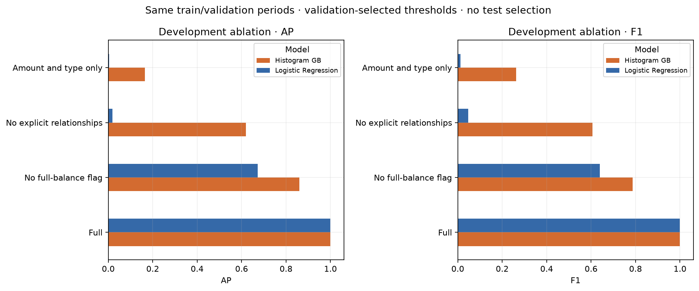

# Fraud risk analysis and historical monitoring

**Business question:** which initiated TRANSFER or CASH_OUT transactions should be referred for review, and how should an analyst monitor the resulting workload?

This reproducible Python project analyses **6.36 million synthetic PaySim transactions**, including **2.77 million eligible TRANSFER/CASH_OUT transactions**. It combines exploratory analysis, chronological model validation and a historical monitoring prototype. Amounts are in **dataset currency units**, not GBP.

## Three findings

1. **The headline score depends on questionable balance information.** Logistic Regression's validation AP falls from **1.0000 to 0.0033** when all balance information is removed. The [publisher warns about balance fields](https://www.kaggle.com/datasets/ealaxi/paysim1/data), so the original high-scoring model is a diagnostic historical experiment, not a credible claim of live-bank effectiveness.
2. **A threshold is also a workload decision.** The amount/type-only logistic model flags **19.95%** of transactions in one rolling forward window, despite using an earlier validation-F1 threshold. Ranking quality and sustainable investigation volume are different objectives.
3. **A higher fraud rate can reflect fewer legitimate transactions.** Validation and historical-test fraud prevalence are **0.1364%** and **0.9827%**. Fraud counts per elapsed step are similar, while legitimate volume falls sharply. The analysis separates these observations from possible simulator explanations.



**Start here:** [analysis decisions](docs/ANALYSIS_DECISIONS.md) · [detailed results](docs/RESULTS.md) · [data source and download instructions](data/README.md) · [run instructions](#reproduce-the-project)

## What the models do and do not establish

| Evidence | Verified result | How to read it |
|---|---|---|
| Conservative development baseline: amount/type Logistic Regression | Validation AP **0.0033**, F1 **0.0123** | Removes the disputed balance fields; weak predictive performance. |
| Conservative development comparison: amount/type histogram boosting | Validation AP **0.1655**, F1 **0.2632** | Better on this development window, with substantial missed fraud; not independently tested. |
| Original frozen balance-dependent Logistic Regression | Historical precision **100.00%**, recall **99.55%**, F1 **0.99775**, AP **1.0000** | Reproduced for audit and monitoring only; input provenance is unresolved and the test has already been viewed. |

AP means non-interpolated average precision, used as the PR-AUC summary. Logistic Regression was the original interpretable baseline; two fixed histogram-boosting variants provided a small non-linear comparison. All original candidates tied on validation AP, so the predeclared order selected Logistic Regression. Its original validation-F1 threshold, **0.911738629900**, remains unchanged.

The original whole-step windows remain **1–323 for training**, **324–377 for validation** and **378–743 for the previously inspected historical test**. Every new ablation and rolling check stays within steps ≤377. Each rolling check separates fitting, threshold selection and forward evaluation. No new split of the inspected data is presented as independent evidence.

## Historical monitoring and business interpretation

The monitoring notebook reuses saved predictions from the original frozen policy. It reports volumes, alerts, amount/type/opening-balance/score distributions, type-level performance and missed fraud. Operational metrics can be calculated at scoring time; precision, recall and fraud prevalence require confirmed labels. This dataset cannot reconstruct confirmation delays.


The fixed replay produces **3,992 alerts across 408,077 eligible transactions**: **97.82 reviews per 10,000 transactions**, with **zero observed false alerts** and **18 misses**. Thirteen misses are zero-amount CASH_OUT records and five are TRANSFER records, prompting a label/amount-semantics check. These are transaction counts, not deduplicated cases or customers.

In a real workflow, false alerts can delay legitimate payments and consume analyst time; missed fraud may expose the institution or customer to loss. Neither zero false alerts in this synthetic sample nor flagged transaction value demonstrates money saved. Linked payment legs can count the same funds twice.

Monitoring bands come from the development period; PSI and type-mix watch levels are explicitly illustrative. The short reference already includes very high per-step alert rates, so broad bands can miss meaningful changes. This is a **historical prototype**, not a production alerting service.

## Navigate the project

| File or directory | Purpose |
|---|---|
| [01_exploratory_analysis.ipynb](01_exploratory_analysis.ipynb) | Business question, data quality, distributions, findings and limitations. |
| [02_fraud_model.ipynb](02_fraud_model.ipynb) | Frozen reproduction, balance-feature ablation and three rolling validation windows. |
| [03_risk_monitoring.ipynb](03_risk_monitoring.ipynb) | Historical monitoring, distribution changes and confirmed-label diagnostics. |
| [docs/ANALYSIS_DECISIONS.md](docs/ANALYSIS_DECISIONS.md) | Reasons for the main analytical and business choices. |
| [docs/RESULTS.md](docs/RESULTS.md) | Full result tables, temporal-prevalence explanation and additional charts. |
| [fraud_utils.py](fraud_utils.py) | Shared feature construction, scoring, metrics and time-window logic. |
| [config/frozen_policy.json](config/frozen_policy.json) | Original policy settings, data fingerprint and reference counts. |
| [tests/test_core.py](tests/test_core.py) and [scripts/](scripts/) | Focused checks and reproducible execution. |
| [reports/](reports/) | Saved aggregate tables, figures and verification records. |

The [PaySim simulator repository](https://github.com/EdgarLopezPhD/PaySim) links to the synthetic dataset. Acquisition, citation and file fingerprint are documented in [data/README.md](data/README.md). The local CSV is preserved but excluded from version control, as are the fitted model and transaction-level predictions in `artifacts/`. The original download history is not independently verified.

## Reproduce the project

Verified using **Python 3.12.14** and the packages pinned in [requirements.txt](requirements.txt); platform details are in [reports/environment.json](reports/environment.json). Use Python 3.12 and run from the project root:

```bash
python3.12 -m venv .venv
source .venv/bin/activate
python -m pip install -r requirements.txt
# Obtain and place the CSV as described in data/README.md.
python scripts/run_notebooks.py
python scripts/check_project.py
```

On Windows, activate `.venv\Scripts\activate` instead. For interactive use, open the notebooks in a Jupyter-capable editor with this environment selected and run them in numerical order. The runner uses the current Python executable, creates a temporary kernel specification, executes each notebook from a fresh kernel, and saves outputs in place. It also runs the eight core logic tests. No network service or API is required.

The local full-data run completed in roughly **two minutes**; time and memory requirements depend on the machine. Allow several GB of working memory. Notebook 02 generates the ignored model and compressed prediction file required by Notebook 03; these are not committed substitutes for the raw data. Existing report files are replaced on a rerun. Floating-point/library changes may affect reproduction, and the frozen-policy assertions deliberately stop rather than silently adopt a different result.

The existing local environment passed `python -m pip check`. **A fresh package installation on another operating system has not been tested.** The raw CSV remains intact and is excluded by `.gitignore`; do not add it with `git add -f`. No production deployment is provided.

## Verification, limitations and next steps

All three notebooks have been executed in order from fresh kernels. Eight focused tests cover chronology, prohibited inputs, balance-free feature construction, preprocessing state, threshold ties, metric calculations, empty periods and reference bins. Saved predictions reconcile with the aggregate monitoring tables. See [execution](reports/execution.json) and [verification](reports/verification.json).

The important limits remain: one synthetic run, unresolved balance semantics, already-inspected test data, correlated development windows, missing label-confirmation timing and no independently verified intervention outcomes. Scores are not calibrated probabilities; no confidence intervals or event-disjoint validation are claimed. Monitoring rules are demonstrations, not validated controls.

Next steps are to verify as-of feature contracts, obtain genuinely new future evidence, assess label maturity and event/account dependence, and agree review capacity and customer-friction objectives before revising the policy. The project is intended to demonstrate analytical judgement and reproducibility, not production readiness.
