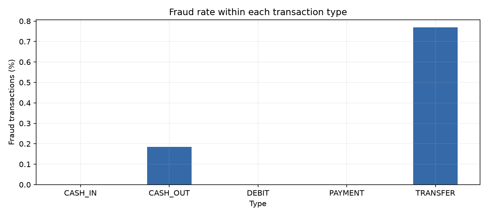
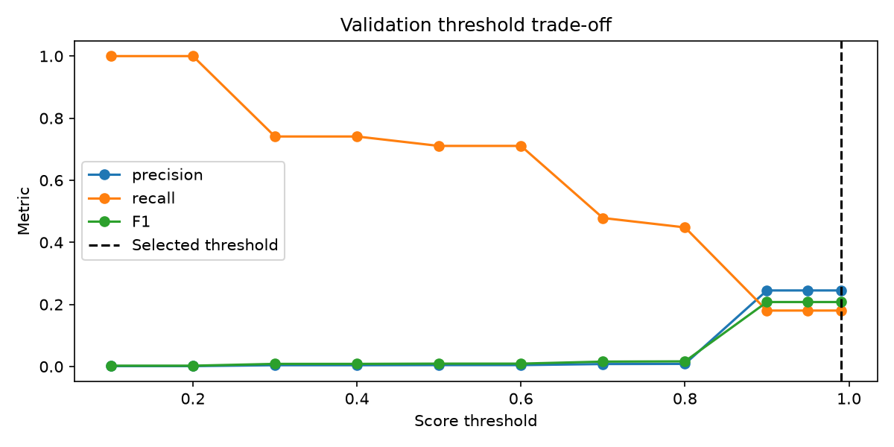
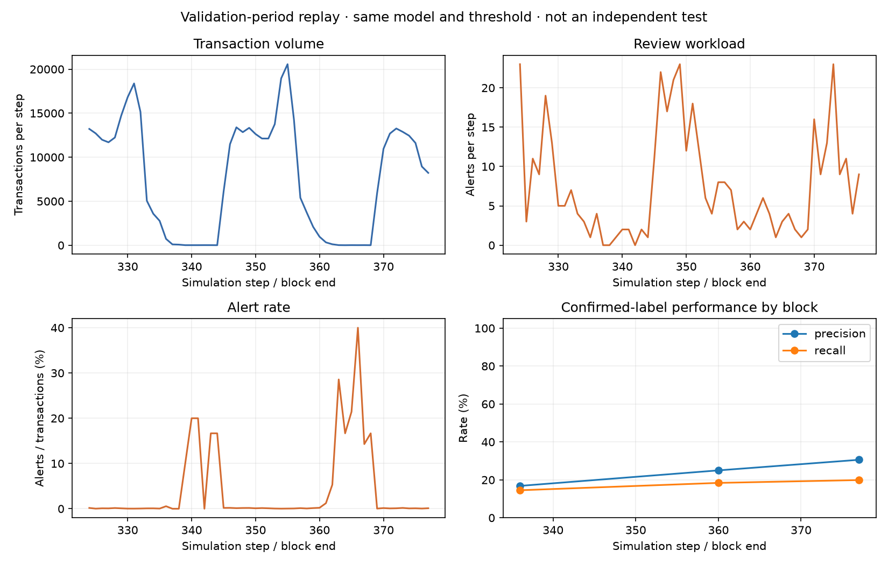

# PaySim fraud risk analysis

An undergraduate actuarial project exploring a practical question: **can transaction amount and type help prioritise fraud reviews before a payment is completed?** It combines exploratory analysis, two simple classification models and a historical replay of the resulting alerts in Python.

The main finding is a trade-off: the selected decision tree flagged **412 transactions**, of which **101 were labelled fraud**, but missed **459 other fraud transactions** in the validation period. This makes review workload and missed cases central to the analysis.

The dataset contains **6,362,620 synthetic transactions**, including **2,770,409 TRANSFER/CASH_OUT transactions**. It comes from [PaySim on Kaggle](https://www.kaggle.com/datasets/ealaxi/paysim1/data). These are simulated mobile-money records, not a bank's customer data. Amounts are in dataset currency units, not GBP. See [data/README.md](data/README.md) for download and placement instructions.

## What is in the project?

| Notebook | Analysis |
|---|---|
| [01 · Exploratory analysis](01_exploratory_analysis.ipynb) | Missing values, fraud proportions by type, skewed amounts and time summaries. |
| [02 · Simple modelling](02_fraud_model.ipynb) | Logistic regression versus a small decision tree, precision/recall and threshold choice. |
| [03 · Basic monitoring](03_risk_monitoring.ipynb) | Transaction counts, alerts, review workload and retrospective label-based results. |

The notebooks contain the analysis and saved outputs. [analysis_helpers.py](analysis_helpers.py) shares the feature and metric calculations; `scripts/` runs and checks the notebooks. Aggregate results are in `reports/`.

## What the data show

Fraud is **0.1291% of all transactions** and **0.2965% within TRANSFER/CASH_OUT**. The denominators differ. All fraud labels in this file occur in those two transaction types, which defines the modelling population. This does not establish that other types are always safe.



The model uses only requested amount and type. Balances are excluded because the publisher warns that the simulation's cancellation behaviour affects them. An earlier balance-dependent model had nearly perfect scores; a saved comparison shows logistic-regression validation AP dropping from **1.0000 to 0.0033** when balance information is removed. This is a reason to question the features, not a claim of real-bank performance. The original results and their history are described in [the previous-version note](docs/PREVIOUS_VERSION.md).

## How the model is evaluated

Training uses steps **1–323**, and validation uses **324–377**. Scaling is fitted on training rows only. Logistic regression is compared with one decision tree limited to three levels; there is no large parameter search. Both use amount and type only.

The model is selected by validation average precision (AP, the non-interpolated PR-AUC summary). Its threshold is chosen by F1 from 11 predefined values, using validation labels only. Accuracy is not the objective. The same validation period is used for selection and reporting, so these results are optimistic development evidence.

**The later period, steps 378–743, was already inspected in the previous version. The revised models are not evaluated on it, and no fresh independent test score is claimed.**

| Validation result | Value |
|---|---:|
| Logistic regression AP | 0.0033 |
| Small decision tree AP | 0.0486 |
| Selected tree precision / recall | 24.51% / 18.04% |
| Selected tree F1 | 0.2078 |
| Alerts / validation transactions | 412 / 410,437 |
| True positives / false positives / false negatives | 101 / 311 / 459 |

The tree was selected by AP. Thresholds 0.90, 0.95 and 0.99 produced the same alerts; the predefined tie rule chose **0.99**. Because training uses class weights, this score should not be read as a 99% probability of fraud. These results show the limits of amount and type as the only inputs.



## Why this relates to actuarial study

Precision and recall are different conditional proportions: the fraud share of alerts versus the detected share of fraud. Fraud frequency and financial severity are also different: a transaction amount is not a confirmed net loss.

The selected threshold creates about **10 reviews per 10,000 transactions**. Roughly three quarters of the alerts are false positives, which could use reviewer time and delay legitimate payments. It also misses about 82% of labelled fraud. A missed transaction may create exposure, but this dataset does not measure recoveries, liability or net losses. A threshold chosen for F1 is therefore a statistical exercise, rather than an established banking decision rule.

Notebook 03 reuses the selected model's **validation-period** predictions. It plots counts and rates with the threshold fixed. Volumes and alerts are available at scoring; precision and recall require confirmed labels. It is a short historical replay, not a live monitoring system or independent stability test.



## Run it

Use Python 3.12. The pinned package versions are in [requirements.txt](requirements.txt).

```bash
python3.12 -m venv .venv
source .venv/bin/activate
python -m pip install -r requirements.txt
# Download and place the CSV as described in data/README.md.
python scripts/run_notebooks.py
python scripts/check_project.py
```

On Windows, activate `.venv\Scripts\activate` instead. You can also open the notebooks in a Jupyter-capable editor, select this environment and run them in order. Allow several GB of memory for the full CSV. Notebook 02 creates the local prediction file needed by Notebook 03.

The CSV and transaction-level predictions stay local and are ignored by Git. Aggregate tables and figures are saved in `reports/`. The scripts provide fresh-kernel execution and a few checks for feature timing, metric arithmetic and consistent outputs. A new package installation on a different operating system has not been verified.

All three simplified notebooks were executed in order from fresh kernels on the full CSV. Four core tests, the output/link checks and `pip check` passed in the existing Python 3.12.14 environment. Execution took about 33 seconds on this machine; this is not a runtime guarantee. See [execution records](reports/execution.json) and [verification results](reports/verification.json).

## Limitations and next steps

This is one synthetic simulation, with only two model inputs, no independent new test data and no label-confirmation dates. The scores are not calibrated probabilities. Monitoring covers only 54 validation steps and its results were already used during selection.

The next steps are to evaluate on genuinely new data, investigate trustworthy additional inputs and compare thresholds against a stated review capacity. The previous version remains in Git history, with its evaluation limitations recorded above.

## Study notes

The [bilingual learning guide](docs/LEARNING_GUIDE.md) explains the regression equations, decision trees, metric calculations and actuarial connections from first principles. It includes worked examples and exercises, in English with Chinese explanations of key ideas.
