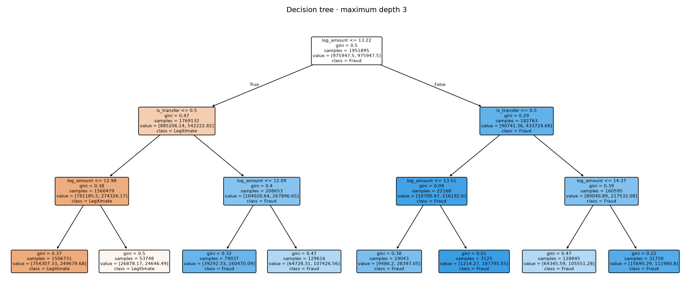

# Learning this project from zero / 从零读懂这个项目

This guide assumes **no previous machine-learning knowledge**. Basic arithmetic is enough to start. The main explanations are in English; Chinese notes unpack the difficult ideas. Important terms stay in English so that you can recognise them in lectures, documentation and interviews.

You do not need to memorise every formula. First understand the question, then follow one calculation, then find the matching code. 可以先看懂“这一段在回答什么问题”，再看公式，不必一开始就背代码。

**Two labels used throughout:** “Project result” means a number from the current saved run. “Teaching example” means invented numbers used only to explain an idea. A teaching example is not evidence about PaySim or a real bank.

## A reading route

| Stage | Read | What you should be able to explain |
|---|---|---|
| First pass | [Sections 1–4](#1-what-are-we-trying-to-do) | What a row means, what the model predicts, and why time matters. |
| Second pass | [Sections 5–9](#5-feature-engineering-turning-rows-into-numbers) | Features, the regression equation, training and the small tree. |
| Third pass | [Sections 10–13](#10-understand-the-actual-confusion-matrix) | Confusion counts, AP, thresholds and monitoring. |
| Later study | [Sections 14–17](#14-connections-to-actuarial-study) | Actuarial connections, code reading, older methods and practice questions. |

Use this guide beside [Notebook 01](../01_exploratory_analysis.ipynb), [Notebook 02](../02_fraud_model.ipynb) and [Notebook 03](../03_risk_monitoring.ipynb). Examples that refer to notebook variables assume the earlier cells have been run in order. Do not modify the original later-period data to improve a model score.

## 1. What are we trying to do?

Imagine an analyst receiving many payment requests. There is not enough time to investigate every one. We want a simple rule that flags some requests for review.

The learning workflow is:

```text
Earlier labelled transactions → learn a model
Later development transactions → calculate scores → choose a threshold
Saved alerts → count review workload and check known outcomes
```

The project is about **classification**: predicting a category, here fraud or legitimate. It is not predicting how much money will actually be lost.

An **alert** is a suggestion to review a transaction. It is not proof of fraud and does not automatically mean “block the payment”. 模型给的是辅助判断，不能把“被标记”直接等同于“有罪”。

### The vocabulary of a dataset

| Term | Meaning in this project | 中文提示 |
|---|---|---|
| Observation / sample | One transaction row | 一条记录，不是一个客户 |
| Dataset | A table containing many rows | 数据集 |
| Feature / input | Information supplied to the model | 用来预测的已知信息 |
| Target / label | The outcome we want to predict | 这里是 `isFraud` |
| Model | A rule learned from examples | 根据已有样本学到的计算规则 |
| Parameter | A value learned during fitting | 例如回归系数 |
| Hyperparameter | A setting chosen outside fitting | 例如树最多三层 |
| Prediction score | A numerical model output | 分数，不一定是真实概率 |
| Threshold | The cutoff that turns a score into an alert | 达到多少分才发出告警 |

We use **supervised learning** because training examples contain the outcome label. The labels teach the model; they must not be part of its inputs. 好比用带答案的练习题学习，但考试时不能把答案一起交给模型。

The simplified project uses `amount` and `type` as inputs. `isFraud = 1` means labelled fraud; `isFraud = 0` means labelled legitimate. `step` orders transactions through simulation time.

PaySim is **synthetic data**: records generated by a simulator. A pattern may reflect how the simulator was built. A good result on it does not establish effectiveness at a real bank.

## 2. Read the data before fitting anything

### 2.1 Counts, proportions and conditional probability

For a binary label, adding the labels counts the fraud records. Taking their mean gives the fraud fraction:

$$
\widehat{P}(F)=\frac{\text{number of fraud transactions}}{\text{number of transactions}}.
$$

The hat in $\widehat{P}$ means an estimate calculated from the sample. $F$ denotes the event “fraud”. It is not a promise about future transactions.

**Teaching example:** labels `[0, 0, 1, 0, 1]` sum to 2. Their mean is $2/5=0.4$, or 40%.

**Project result:** all 6,362,620 transactions contain 8,213 fraud labels: about **0.1291%**. Restricting to TRANSFER and CASH_OUT leaves 2,770,409 transactions with the same 8,213 fraud labels: about **0.2965%**.

The numerator is the same, but the denominator changes. 每次说一个比例，都要追问：“在谁里面占多少？”

For a particular type $T$:

$$
\widehat{P}(F\mid T)=\frac{\text{fraud transactions of type }T}{\text{all transactions of type }T}.
$$

The vertical bar means **given / conditional on**. “Fraud given TRANSFER” is not the same as “TRANSFER given fraud”. The first starts with TRANSFER transactions; the second starts with fraud transactions.

In Notebook 01, `groupby('type')` separates the rows by type, then `size`, `sum` and `mean` calculate counts and rates. This is the programming version of conditional proportions.

### 2.2 Mean, median and the long tail

**Teaching example:** amounts `[10, 20, 30, 40, 900]` have mean 200 and median 30. The mean uses every value; the median is the middle observation after sorting.

The large final value creates **right skew**: a long tail towards large amounts. The median is often easier to interpret as a typical amount in that situation. A **quantile** describes a position in the distribution: the 90th percentile is a value at or below which approximately 90% of observations fall, depending on the sample convention.

Do not automatically delete large amounts as **outliers**. They may be data errors, legitimate large payments or relevant fraud cases. 先问“为什么大”，不是先把它删掉。

The amount histogram compares each class's **density**, so each class's histogram area is normalised separately. Similar bar heights do not imply equal numbers of fraud and legitimate transactions.

### 2.3 Missing values are not zeros

`NaN` usually represents a missing or undefined value. Zero is a recorded value. A zero-amount transaction is unusual, but replacing it with an average would change the evidence. Notebook 01 counts it instead.

This notebook checks the five columns it loads. It does not establish that every account identifier, label or record in the source is correct.

## 3. Class imbalance and the accuracy trap

**Class imbalance** means one outcome is much more common than the other. In our validation period, 560 of 410,437 transactions are labelled fraud; 409,877 are labelled legitimate.

Consider a **baseline** that always says “legitimate”:

$$
\text{Accuracy}=\frac{409{,}877}{410{,}437}=99.8636\%.
$$

It looks impressive, but it detects **zero fraud**. A baseline is a simple reference, not necessarily a useful solution.

For comparison, the selected tree's accuracy is about 99.8124%, slightly lower than this useless baseline, even though it identifies 101 fraud transactions. This illustrates why accuracy is not the selection objective here. 不能因为大部分交易本来就正常，就把“全猜正常”当作优秀模型。

We will focus on **precision, recall, F1 and average precision**. They answer more relevant questions, but no single metric captures every business cost.

## 4. Training, validation, testing and leakage

### 4.1 What each dataset is for

| Set | Purpose | What it may influence |
|---|---|---|
| Training set | Learn coefficients or tree splits | Fitted parameters and preprocessing statistics |
| Validation set | Compare choices during development | Model choice and the alert threshold |
| Independent test set | Assess a final fixed choice | Final reporting, not repeated tuning |

**Training** is learning a rule. **Validation** is checking which development choice seems better. **Testing** is checking a fixed choice on evidence that did not guide it.

An exam analogy is useful: training is practice, validation is a mock exam used to revise your approach, and a genuinely untouched test is the final exam. Repeatedly using the final exam answers to revise makes it another practice paper.

### 4.2 Our actual time windows

| Period | Steps | Transactions | Fraud labels |
|---|---|---:|---:|
| Training | 1–323 | 1,951,895 | 3,643 |
| Validation | 324–377 | 410,437 | 560 |
| Previously inspected later period | 378–743 | Not evaluated for revised models | Not used to select revised models |

This is a **temporal split**: earlier rows train the model and later rows validate it. A random split might let a model learn from transactions that occur after the transactions being evaluated.

Time ordering does not guarantee independence. Related payments or accounts can occur in both windows. We also do not know when each fraud label would have been confirmed in real time.

The current project has **no new independent test result**. The later period was already inspected in the earlier version. The revised validation period is used both to select the model/threshold and to report results, creating **selection optimism**: the reported choice benefited from seeing those labels.

### 4.3 What is data leakage?

**Data leakage** happens when information that would not legitimately be available for the intended prediction influences the model or its assessment.

Examples in this project:

- Passing `isFraud` as a feature effectively hands the model the answer.
- Using a closing balance to decide whether to approve an initiated payment uses information from after that decision.
- Fitting a scaler on training plus validation rows lets validation data influence preprocessing.
- Choosing a threshold because it works best on the historical test makes that test part of development.

Opening balances sound safe because of their names. However, the publisher warns about how the simulator records balances. Therefore the simplified model excludes **all balances**, including features derived from them. 排除明显的交易后字段还不够，也要理解字段到底是怎么生成的。

The earlier comparison gave logistic AP 1.0000 with balance-related inputs and 0.0033 without them. This establishes dependence on those inputs, not proof of the precise contamination mechanism. See [the earlier-version explanation](PREVIOUS_VERSION.md).

## 5. Feature engineering: turning rows into numbers

**Feature engineering** means choosing or calculating the inputs used by the model. Here there are only two engineered features.

### 5.1 Log amount

$$
u=\ln(1+a),
$$

where $a$ is transaction amount and $\ln$ is the natural logarithm, with base $e\approx2.71828$.

**Teaching examples:** amount 0 becomes 0; amount 99 becomes $\ln(100)\approx4.605$; amount 999 becomes $\ln(1000)\approx6.908$. A tenfold increase in amount no longer creates a tenfold increase in the feature.

`np.log1p(amount)` calculates this transformation. Adding 1 allows zero amounts. The log reduces the long tail; it does **not** guarantee a normal distribution or automatically solve modelling problems.

Notebook 01 uses **log base 10** for a readable histogram axis. Notebook 02 uses the **natural log** for the model. These are different scales, both used deliberately. 不要拿图中的 `log10` 数值直接代入模型的 `log_amount`。

### 5.2 Binary encoding of type

$$
x_2=\begin{cases}1&\text{TRANSFER}\\0&\text{CASH\_OUT.}\end{cases}
$$

This is an **indicator variable / dummy variable**. The model can now use a numerical distinction between the two categories. CASH_OUT is the reference category. The value 1 does not mean TRANSFER is “one unit more money”.

The following is the feature calculation from `analysis_helpers.py`, shown with a complete dictionary. It assumes `pd`, `np` and `data` are already defined in the notebook:

```python
features = pd.DataFrame({
    'log_amount': np.log1p(data['amount']),
    'is_transfer': data['type'].eq('TRANSFER').astype(int),
}, index=data.index)
```

The dictionary names the new columns and gives their values; `pd.DataFrame` builds a table. `eq` means equality comparison; `astype(int)` converts `True`/`False` to 1/0.

### 5.3 Standardisation

For logistic regression, log amount is then standardised:

$$
x_1=\frac{u-\mu_{\mathrm{train}}}{\sigma_{\mathrm{train}}}.
$$

Here $\mu_{\mathrm{train}}$ is the training mean of log amount and $\sigma_{\mathrm{train}}$ is its training standard deviation. A value of 0 is the training mean; 1 is one training standard deviation above it. The binary type variable is not standardised here.

**Teaching example:** if training log amounts have mean 10 and standard deviation 2, a log amount of 12 becomes $(12-10)/2=1$. Validation values must use that same 10 and 2. Do not recalculate them on validation data.

Scaling makes coefficient fitting and regularisation easier to manage across input scales. It does not remove skew or make the outcomes normally distributed. In this implementation `StandardScaler` estimates its statistics during `fit`; its standard deviation uses `ddof=0`, unlike pandas' usual sample-standard-deviation default. [Official StandardScaler reference](https://scikit-learn.org/stable/modules/generated/sklearn.preprocessing.StandardScaler.html).

The **tree** receives unstandardised `log_amount` and the same type indicator. Read a plotted tree split in that log-amount scale, not as a standard-deviation cutoff.

## 6. The regression equation, one symbol at a time

### 6.1 First: ordinary linear regression

A familiar regression equation is:

$$
Y=\beta_0+\beta_1x_1+\beta_2x_2+\varepsilon.
$$

| Symbol | Meaning |
|---|---|
| $Y$ | The numerical outcome being modelled |
| $x_1,x_2$ | Known inputs for one observation |
| $\beta_0$ | Intercept: the starting level when inputs are zero |
| $\beta_1,\beta_2$ | Coefficients: how the linear expression changes with the inputs |
| $\varepsilon$ | Outcome variation not explained by that expression |

Linear regression is commonly used for numerical outcomes such as an amount. However, a straight-line prediction can fall below 0 or above 1. That is awkward when modelling a binary fraud label as a probability.

### 6.2 Logistic regression

Logistic regression first calculates a **linear predictor**:

$$
z=\beta_0+\beta_1x_1+\beta_2x_2.
$$

It then applies the **logistic function / sigmoid**:

$$
q=\frac{1}{1+e^{-z}}.
$$

The output is between 0 and 1. If $z=0$, then $q=0.5$; if $z$ is very positive, $q$ approaches 1; if very negative, it approaches 0. $e^{-z}$ is an exponential, not a variable named “e minus z”.

We use $q$ to emphasise **model score**. In a suitably specified ordinary probability model it estimates a conditional probability. In this class-weighted project, it is not established as a calibrated real-world probability.

Logistic regression keeps “regression” in its name because it models a numerical relationship in **log-odds**. We use it for classification by applying a threshold to its output. 所以名字里有 Regression，但这里回答的是“属于哪一类”。

### 6.3 Odds and log-odds

For a probability $p$:

$$
\text{odds}=\frac{p}{1-p},\qquad
\text{logit}(p)=\ln\left(\frac{p}{1-p}\right).
$$

**Teaching example:** $p=0.2$ means 20% probability. Its odds are $0.2/0.8=0.25$, or one event for every four non-events. Probability and odds are different quantities.

The logistic equation can be written:

$$
\ln\left(\frac{q}{1-q}\right)=\beta_0+\beta_1x_1+\beta_2x_2.
$$

The **log-odds**, not the probability itself, are linear in the inputs. This is the main mathematical idea to understand before worrying about optimisation.

### 6.4 A complete hand calculation — teaching example only

Suppose $\beta_0=-2$, $\beta_1=0.8$, $\beta_2=1.5$. These are **invented**, not our fitted coefficients. Suppose one transaction has $x_1=1$ and $x_2=1$.

1. Multiply inputs by their coefficients: $0.8(1)=0.8$ and $1.5(1)=1.5$.
2. Add the intercept: $z=-2+0.8+1.5=0.3$.
3. Apply the sigmoid: $q=1/(1+e^{-0.3})\approx0.5744$.
4. At threshold 0.50, this transaction is flagged. At threshold 0.70, it is not.

The model calculation stayed the same; the **decision rule** changed. 分数怎么计算和多少分发出告警，是两个不同问题。

This standalone snippet repeats the arithmetic:

```python
import math

z = -2 + 0.8 * 1 + 1.5 * 1
score = 1 / (1 + math.exp(-z))
print(round(score, 4))  # 0.5744: teaching example, not a project prediction
```

### 6.5 The coefficients actually fitted in this project

From [the saved coefficient table](../reports/tables/logistic_coefficients.csv), rounded:

$$
z=b_0+0.3753x_1+1.2995x_2.
$$

$b_0$ is the fitted intercept. The coefficient CSV does not contain it, so this displayed equation is **not enough to calculate an actual transaction's score**. Do not substitute the teaching intercept of −2.

Using the unrounded coefficients in the CSV, holding type fixed, a one-standard-deviation increase in **log amount** multiplies the model's odds by $e^{\beta_1}\approx1.4554$. Holding log amount fixed, changing CASH_OUT to TRANSFER multiplies those model odds by $e^{\beta_2}\approx3.6673$.

These are **odds ratios**, not percentage-point increases or multiples of the probability. They describe associations within the fitted weighted model, not causal effects on a customer's fraud behaviour.

After the fitting cell in Notebook 02, these lines expose the complete calculation without changing the model:

```python
b0 = logistic.named_steps['model'].intercept_[0]
beta = logistic.named_steps['model'].coef_[0]
X_scaled = logistic.named_steps['scale'].transform(X_validation.iloc[:1])
z = b0 + X_scaled[0] @ beta  # @ means multiply corresponding entries and add
manual_score = 1 / (1 + np.exp(-z))
print(manual_score, logistic.predict_proba(X_validation.iloc[:1])[0, 1])
```

The two printed scores should agree apart from numerical rounding. This is a useful way to connect the equation to the library call.

## 7. How does the model learn the coefficients?

### 7.1 Fitting minimises an objective

We do not manually choose each coefficient. **Fitting / training** finds values that make an objective smaller on the training rows.

For one binary outcome, **log loss / binary cross-entropy** is:

$$
\ell(y,q)=-\left[y\ln(q)+(1-y)\ln(1-q)\right].
$$

$y$ is the known label, 0 or 1; $q$ is the model score. When $y=1$, only $-\ln(q)$ remains. When $y=0$, only $-\ln(1-q)$ remains. The terms switch on and off because the label is binary.

**Teaching example:** for an actual fraud transaction, scores 0.9 and 0.1 give losses about 0.105 and 2.303 respectively. A confident wrong answer is penalised more strongly.

For ordinary unweighted logistic regression, minimising total log loss corresponds to maximising the Bernoulli **likelihood**: how well the model's probabilities explain the observed labels under the model. Our implementation additionally weights classes and regularises coefficients.

The solver repeatedly adjusts coefficients to reduce the training objective. You do not need to derive the numerical algorithm to understand the experiment. The current `lbfgs` solver is an optimiser; it is not another fraud model.

### 7.2 Class weighting

Without weights, the many legitimate rows can dominate the objective. The code uses `class_weight='balanced'`. For class $k$, its weight is:

$$
w_k=\frac{N}{K N_k},
$$

where $N$ is the number of training rows, $K=2$ is the number of classes, and $N_k$ is the training count in that class. This is the implementation's class-balancing rule. [Official LogisticRegression reference](https://scikit-learn.org/stable/modules/generated/sklearn.linear_model.LogisticRegression.html).

Using our training counts, each fraud row has weight about **267.90**, and each legitimate row about **0.5009**. The total contribution assigned to each class is balanced before considering individual losses.

This changes the fitting objective. It does not change the stored labels, generate additional fraud examples or mean that half of future transactions will be fraudulent. 权重是在学习时“更重视少数类”，不是把现实中的欺诈率改成 50%。

Because the objective has changed, a high score need not equal the observed fraud fraction among similarly scored transactions. **Calibration** asks whether predicted probabilities agree with observed frequencies; this project does not establish that agreement.

### 7.3 Regularisation and overfitting

**Overfitting** means learning patterns that suit the training data but do not generalise well. **Underfitting** means a model is too restricted, or its features too limited, to represent useful patterns.

**Regularisation** discourages unnecessarily large coefficients. A schematic weighted objective is:

$$
\sum_i w_{y_i}\ell(y_i,q_i)+\lambda\sum_j\beta_j^2.
$$

$i$ indexes transactions; $j$ indexes feature coefficients. The symbol $\sum$ means add the terms over that index. $\lambda\ge0$ controls how strongly large coefficients are discouraged. The second term is an **L2 penalty**. This expression illustrates the trade-off, not the exact normalisation used internally by the software. It does not include an intercept penalty in this schematic.

The installed logistic defaults use L2 regularisation and `C=1.0`. Smaller `C` means stronger regularisation. We did not search over `C`. `max_iter=1000` is an upper limit on optimisation iterations, not the number of models trained; the solver may stop earlier. [Parameter definitions](https://scikit-learn.org/stable/modules/generated/sklearn.linear_model.LogisticRegression.html).

An important distinction: the training **loss function** is not validation F1. The model fits coefficients with its loss; we then compare ranking and choose an alert cutoff with different metrics.

## 8. What a Pipeline does

Notebook 02 builds:

```python
preprocessing = ColumnTransformer([
    ('amount', StandardScaler(), ['log_amount']),
], remainder='passthrough')

logistic = Pipeline([
    ('scale', preprocessing),
    ('model', LogisticRegression(class_weight='balanced', max_iter=1000, random_state=42)),
])
```

This excerpt assumes the imports in Notebook 02 have already run.

`ColumnTransformer` applies scaling only to the named `log_amount` column. `remainder='passthrough'` leaves `is_transfer` unchanged. `Pipeline` keeps those transformations and the estimator in one ordered procedure.

When calling `logistic.fit(X_train, y_train)`, it learns the scaler's training statistics and then fits the logistic coefficients on transformed training inputs. When calling `predict_proba(X_validation)`, it reuses those statistics; it does not learn new validation scaling values.

`fit` means **learn settings from data**. `transform` means **apply an already defined transformation**. `fit_transform` does both. 在验证集上应使用已有规则转换，而不是重新学习一套规则。

`predict_proba` returns a column per class. Our classes are 0 and 1, so `[:, 1]` selects the score for class 1 across all rows. Despite the method name, the class-weighted output still needs the calibration caveat.

The logistic model's default `.predict()` decision would use its standard class cutoff; the project instead creates alerts explicitly with `score >= threshold`. Always check which decision rule produced a reported confusion table.

## 9. The small decision tree

### 9.1 A tree asks a sequence of questions

A **decision tree** splits rows into groups using questions such as “is log amount below this value?” and “is the transaction a TRANSFER?” A **node** contains a group; a **split** divides it; a **leaf** is a final group.

Unlike logistic regression's single linear log-odds expression, a tree can assign different scores to different input regions. The splits are learned from training rows, not handwritten banking rules.

The code fixes `max_depth=3` and `min_samples_leaf=100`. The first limits the number of splits along a root-to-leaf path; it does not mean “three leaves”. The second requires at least 100 training rows in a leaf, not 100 fraud rows. These restrictions keep the tree small; they do not prove it will generalise.

### 9.2 How a split is judged

For binary proportions $p_0,p_1$ in a node, **Gini impurity** is:

$$
G=1-p_0^2-p_1^2.
$$

**Teaching example:** a 50/50 group has impurity 0.5. A 90/10 group has impurity 0.18. A pure group has impurity 0. A split is useful if its children reduce the appropriately weighted impurity relative to the parent. Our class-weighted tree uses weighted class proportions for this purpose. [Decision-tree documentation](https://scikit-learn.org/stable/modules/tree.html).

Gini here is a classification impurity measure; it is not an insurance premium or a measure of realised financial inequality in this dataset.

### 9.3 The score in a leaf

The tree assigns a leaf's weighted fraud share to every row reaching that leaf. A tree with few leaves therefore produces only a few distinct scores.

**Teaching example using rounded class weights:** a leaf containing 10 fraud and 990 legitimate training rows has an unweighted fraud share of 1%. With weights 268 and 0.501, its weighted share is approximately:

$$
\frac{10(268)}{10(268)+990(0.501)}\approx84.4\%.
$$

That example is not one of our recorded leaves. It illustrates why a weighted leaf score can be high even when the raw fraud fraction is low. 这也是不能把 0.99 分数直接说成“99% 真实欺诈概率”的原因之一。

### 9.4 Read the project tree



Start at the top. Follow left when the printed condition is true and right when false, until reaching a leaf. `samples` counts training rows; `value` contains weighted class counts here. The displayed `class` is the majority weighted class, **not** the project's final alert decision at threshold 0.99.

The tree can miss subtle patterns because it is shallow and has only two features. A larger tree might fit more patterns but could overfit. We did not keep enlarging it until the results looked better.

## 10. Understand the actual confusion matrix

A **confusion matrix** compares the predicted decision with the known label. In this project, “predicted positive” means an alert.

**Project result — selected tree, validation period, threshold 0.99:**

| Known label | Alert | No alert | Total |
|---|---:|---:|---:|
| Fraud | TP = 101 | FN = 459 | 560 |
| Legitimate | FP = 311 | TN = 409,566 | 409,877 |
| Total | 412 | 410,025 | 410,437 |

- **True positive (TP):** fraud correctly alerted.
- **False positive (FP):** legitimate transaction alerted; a false alarm.
- **False negative (FN):** fraud not alerted; a miss.
- **True negative (TN):** legitimate transaction not alerted.

“Positive/negative” refers to the model decision; “true/false” tells us whether that decision matches the label. Positive does not mean “good”.

### Precision: how useful are the alerts?

$$
\text{Precision}=\frac{TP}{TP+FP}=\frac{101}{412}=24.51\%.
$$

Start with the **alert pile**. About one in four alerts is labelled fraud in this validation sample. In conditional-probability language, this estimates $P(F\mid A)$, where $A$ is the event “alert”.

### Recall: how much fraud did we find?

$$
\text{Recall}=\frac{TP}{TP+FN}=\frac{101}{560}=18.04\%.
$$

Start with the **fraud pile**. The rule catches about 18 in every 100 labelled fraud transactions. This estimates $P(A\mid F)$.

中文记法：Precision 问“报出来的有多少是真的”；Recall 问“真的里面找到了多少”。分母不能交换。

### F1: a compromise, not a business cost

$$
F1=\frac{2PR}{P+R}=\frac{2TP}{2TP+FP+FN}
=\frac{202}{202+311+459}\approx0.2078.
$$

Here $P$ and $R$ mean precision and recall. F1 is their **harmonic mean**, which is pulled down when either is low. It is not their ordinary arithmetic average. It also does not use TN or price the financial impact of FP and FN.

### Alert rate and false-positive rate have different denominators

$$
\text{Alert rate}=\frac{TP+FP}{N},\qquad
\text{False-positive rate}=\frac{FP}{FP+TN}.
$$

Our alert rate is $412/410437\approx0.1004\%$, or about **10.04 reviews per 10,000 eligible transactions**. The fraction of alerts that are false is $311/412\approx75.49\%$; that is **not** the false-positive rate, whose denominator is all legitimate transactions.

If there are no alerts, precision has denominator zero and is undefined. The helper returns `NaN`, not 100%. If there are no fraud labels, recall is undefined. A missing value can be the correct mathematical answer.

## 11. Ranking, PR curves and average precision

### 11.1 Ranking and decisions are different

Before choosing a threshold, a model ranks transactions by score. **Ranking quality** asks whether fraud tends to appear near the top. An **operating point** is the precision/recall pair at a particular threshold.

A **precision–recall curve** shows the available pairs as the threshold changes. You cannot read it as “every point is achieved at once”. One deployed cutoff would give one point, subject to ties.

### 11.2 Average precision (AP)

For recall levels considered in increasing order:

$$
AP=\sum_k(R_k-R_{k-1})P_k.
$$

Here $k$ indexes the operating levels, $R_k$ is recall and $P_k$ is precision at level $k$; the starting recall is zero. Each gain in recall is weighted by the precision at that level. scikit-learn's AP uses a non-interpolated convention. It is not necessarily the trapezoidal area under straight lines drawn between PR points. In this project “PR-AUC summary” refers specifically to AP. [Official AP definition](https://scikit-learn.org/stable/modules/generated/sklearn.metrics.average_precision_score.html).

**Teaching example without tied scores:** sorted labels are `[1, 0, 1, 0]`. Fraud is found at ranks 1 and 3. Precision at those ranks is 1 and $2/3$. AP is $(1+2/3)/2\approx0.8333$. This shortcut works for this untied example; grouped score ties need the general calculation.

**Project results:**

| Model | Validation AP |
|---|---:|
| Logistic regression | 0.003317 |
| Small decision tree | 0.048637 |

The tree is selected because its validation AP is higher, not because its training score is higher. The validation fraud rate, approximately 0.001364, is a useful no-skill PR reference level; finite random rankings need not have AP exactly equal to it.

AP **0.0486 does not mean 4.86% accuracy or 4.86% recall**. It is a ranking summary. The selected tree still misses most fraud at the reported operating threshold. A model can rank better than another and still be inadequate for a real decision.

## 12. Choosing a threshold: the same model, different workload

The decision rule is:

$$
\text{alert}=\mathbb{1}\{q\ge t\},
$$

where $t$ is the threshold and $\mathbb{1}$ is an **indicator function**: 1 if the condition is true, otherwise 0. Equality raises an alert in this project.

For fixed scores, raising the threshold cannot increase the number of alerts. Recall cannot increase either. Precision may improve, but it is **not guaranteed to increase at every step**, because the removed transactions can include fraud.

The project compares 11 predefined thresholds and selects the highest validation F1. If F1 ties, it chooses the highest threshold. This is a small grid, not an exhaustive search or a proved financial optimum.

**Project results for the same selected tree:**

| Threshold | Alerts | True positives | False positives | Misses | Precision | Recall |
|---|---:|---:|---:|---:|---:|---:|
| 0.50 | 84,564 | 398 | 84,166 | 162 | 0.47% | 71.07% |
| 0.90 | 412 | 101 | 311 | 459 | 24.51% | 18.04% |
| 0.99 | 412 | 101 | 311 | 459 | 24.51% | 18.04% |

The lower cutoff catches more fraud but refers a very large number of legitimate transactions. The higher cutoff reduces workload but misses much more fraud. 不是“阈值越高越好”，而是不同错误与工作量之间的取舍。

Why do 0.90 and 0.99 give the same result? There are no validation scores crossing between those cutoffs in this fitted tree. Its leaf-based scores are discrete. Threshold 0.95 also gives the same result, and the tie rule picks 0.99.

You may explore thresholds on development data as a learning exercise, but do not then claim those same data provide an independent final evaluation. The older inspected period cannot be made fresh merely by renaming or reshuffling it.

## 13. What monitoring adds

Fitting a model answers how it scores records. **Monitoring** asks what happens to the activity and workload when that scoring rule is applied over time.

Notebook 03 reads the saved validation predictions. It does not refit the model, choose another threshold or introduce new test evidence.

| Metric | Denominator or calculation | Needs confirmed labels? |
|---|---|---|
| Volume | Number of transactions in the period | No |
| Alerts | Number with score at least the fixed cutoff | No |
| Alert rate | Alerts / transactions | No |
| TRANSFER share | TRANSFER rows / transactions | No |
| Amount or score median | Middle of that period's values | No |
| Fraud rate | Fraud labels / transactions | Yes |
| Precision / recall / misses | Confusion counts | Yes |

**Teaching example:** period A has 10 alerts among 1,000 transactions; period B has 10 among 100. Alert rates are 1% and 10%, but reviewer workload is still 10 transactions in each. A rate can rise because its denominator falls.

The project uses hourly counts and blocks of up to 24 simulation steps. Boundary blocks can be shorter. Always read their sample counts and boundaries before comparing totals.

**Label delay** means a transaction's true status may be confirmed later. Fraud labels in the file are retrospective; the original scorer would not necessarily have known them immediately. A sudden change in observed precision could reflect incomplete labels rather than a changed model.

**Distribution shift** means the inputs or outcomes have a different distribution across periods. A shift is something to investigate, not automatic proof of fraud or model failure. The simplified project uses descriptive tables, not a formal significance test or automatic retraining rule.

## 14. Connections to actuarial study

### 14.1 Frequency and severity

**Frequency** asks how often an event occurs. **Severity** asks how large its loss is when it occurs. Our fraud rate is an empirical transaction-level event frequency; transaction amount is not verified net loss.

For a conceptual fraud-loss variable $L$ that is zero whenever fraud does not occur, let $X$ represent the known transaction information. $E[\cdot\mid X]$ means the **conditional expectation**: the modelled average over possible outcomes given that information, not a guaranteed outcome for one transaction. Then:

$$
E[L\mid X]=P(F\mid X)\times E[L\mid F,X].
$$

This follows by separating fraud and non-fraud outcomes in conditional expectation. It assumes the defined fraud loss is zero outside fraud; a broader total-cost variable could also include costs on legitimate transactions.

The formula is **not estimated by this project**. Our weighted score is not a validated $P(F\mid X)$, and we do not observe recoveries, liability or net losses needed for severity. 不可以把“模型分数 × 交易金额”直接包装成已经验证的预期损失。

### 14.2 Why low prevalence affects precision: a Bayes example

With $F=$ fraud and $A=$ alert, Bayes' rule gives:

$$
P(F\mid A)=\frac{P(A\mid F)P(F)}
{P(A\mid F)P(F)+P(A\mid F^c)P(F^c)}.
$$

$F^c$ means “not fraud”. Here recall is $P(A\mid F)$ and the false-positive rate is $P(A\mid F^c)$.

**Teaching example:** among 100,000 transactions, suppose 100 are fraud. A rule detects 80% of fraud and flags 1% of legitimate transactions. It produces 80 true positives and 999 false positives, so precision is $80/1079\approx7.41\%$.

Even an apparently small false-positive rate can create many false alerts when legitimate transactions dominate. This example is not our tree's result; it explains the importance of the base rate.

### 14.3 Costs are not the same as F1

A toy decision-cost expression might be:

$$
\text{Total cost}=c_{\mathrm{review}}(TP+FP)+c_{\mathrm{friction}}FP+c_{\mathrm{miss}}FN.
$$

The $c$ terms are assumed costs, not fitted coefficients. This deliberately simplified expression assumes constant per-transaction costs and omits many practical consequences. The dataset does not provide defensible values for those assumptions.

It explains why changing costs or review capacity could change a preferred threshold. It does not justify an invented savings figure.

### 14.4 Where GLMs fit

**Generalised linear model (GLM)** is a family combining an outcome distribution, a linear predictor and a link function. Ordinary logistic regression is a Bernoulli/binomial-response GLM with a logit link. Count and severity modelling can use other GLM choices, depending on the outcome and assumptions.

Our penalised, class-weighted classifier is related to that framework, but we have not fitted an actuarial frequency–severity model or produced coefficient significance tests. Predictive coefficients do not automatically establish causality or statistical significance.

## 15. Read the code without getting lost

The library names are tools, not competing models: **pandas** handles tables (`pd`), **NumPy** handles numerical arrays and functions (`np`), **Matplotlib** draws charts (`plt`), and **scikit-learn** supplies preprocessing, models and metrics. An `import` makes those tools available to the current Python session.

| Code you see | What it means |
|---|---|
| `data.loc[condition]` | Keep rows satisfying a condition. |
| `data[['amount', 'type']]` | Select only these two columns. |
| `.copy()` | Create a separate table for subsequent changes. |
| `.groupby('type')` | Form groups with the same transaction type. |
| `.agg(...)` | Calculate summaries within each group. |
| `X_train`, `y_train` | Training inputs and training labels. |
| `model.fit(X_train, y_train)` | Learn the model from training examples. |
| `model.predict_proba(X_validation)[:, 1]` | Calculate class-1 scores for validation rows. |
| `score >= threshold` | Turn scores into Boolean alert decisions. |
| `.idxmax()` | Find the index of the first maximum value. |
| `assert condition` | Stop execution if an expected property is false. |
| `.to_csv(...)` | Save a table; this does not train a model. |

`random_state=42` fixes a seed where the algorithm uses randomness. It does not make 42 a special modelling choice or guarantee identical results across all software versions. With our logistic `lbfgs` solver, this setting does not control the optimisation; it is useful for the tree's randomness. [Solver and seed behaviour](https://scikit-learn.org/stable/modules/generated/sklearn.linear_model.LogisticRegression.html).

### Follow the files

| File | Read it when you want to understand… |
|---|---|
| [01_exploratory_analysis.ipynb](../01_exploratory_analysis.ipynb) | Population, amounts and descriptive time comparisons. |
| [02_fraud_model.ipynb](../02_fraud_model.ipynb) | Features, fitting, selection and threshold comparison. |
| [03_risk_monitoring.ipynb](../03_risk_monitoring.ipynb) | What the saved alerts look like through time. |
| [analysis_helpers.py](../analysis_helpers.py) | The exact feature and metric calculations. |
| [model summary](../reports/model_summary.json) | The saved selected model name, threshold and validation counts. |
| [threshold table](../reports/tables/threshold_comparison.csv) | How counts change when the same scores use different cutoffs. |

The four small tests check permitted feature inputs, metric arithmetic, undefined precision and threshold direction. The execution/check scripts also verify chronology and consistent saved outputs. Passing checks helps catch coding mistakes; it cannot prove that the dataset reflects real banking behaviour.

## 16. Optional vocabulary from the earlier version

You do not need these methods to understand the current three notebooks. They are listed so that the older project history is less intimidating.

| Term | Beginner explanation | Status here |
|---|---|---|
| Feature ablation | Remove an input or input group and compare results under the same protocol. | A saved earlier balance comparison is retained; it is not a new test. |
| Rolling temporal validation | Repeatedly fit earlier, choose a threshold later and evaluate further forward. | Present in the earlier version, removed from the main learning path. Overlapping windows are not independent tests. |
| Gradient boosting | Combine a sequence of small models, each helping improve the current fitted predictor. | Earlier comparison only; no need to learn its optimisation now. |
| Hyperparameter tuning | Compare settings such as tree depth using development data. | No large search in this version; its few settings are fixed. |
| Cross-validation | Repeat fitting/evaluation across folds rather than use one split. | Not run in the simplified version; random folds can be inappropriate for a time-ordered task. |
| PSI | Compare proportions in bins across two distributions. | Removed from the main version; a descriptive shift measure, not proof of model failure. |
| Calibration | Check whether scores interpreted as probabilities match observed frequencies. | Not established or fitted here. |
| Resampling / SMOTE | Change training class representation, sometimes with synthetic minority examples. | Not used. It is different from class weighting and must not contaminate validation. |

You can say “I have not studied that method in depth yet.” That is more useful than pretending every method in the previous version is already familiar.

## 17. Practice, answers and interview preparation

### Small exercises

Try these before reading the answers. They require arithmetic and explanations, not editing or refitting the project.

1. A sample has 20 fraud labels among 10,000 transactions. What is fraud prevalence? What accuracy does an always-legitimate rule achieve?
2. A rule creates 50 alerts, containing 10 of the sample's 20 fraud cases. Calculate precision, recall, false positives and misses.
3. In a teaching logistic model, $z=-1+0.5x_1+1.0x_2$. Calculate the score when $x_1=2,x_2=0$. Is it alerted at cutoff 0.5 under our rule?
4. Training log amount has mean 8 and standard deviation 2. A validation log amount is 10. What transformed value should be passed to the logistic model?
5. The fraud label is already in the CSV. Why not add it to `X_train`?
6. On fixed scores, can raising the threshold increase alerts? Must it increase precision?
7. Why is the project's 0.99 cutoff not evidence of 99% precision?
8. Why is there no fresh test score for the revised model?
9. If an amount coefficient is positive, have we shown that increasing a payment amount causes fraud?
10. Which monitoring metrics can be calculated before fraud labels are confirmed?

### Answers — check your reasoning

1. $20/10000=0.2\%$ fraud. Always-legitimate accuracy is 99.8%, with zero detected fraud.
2. Precision $10/50=20\%$; recall $10/20=50\%$; FP = 40; FN = 10.
3. $z=0$, so the sigmoid score is 0.5. Yes: the alert condition includes equality.
4. $(10-8)/2=1$. Reuse training statistics; do not fit a new validation scaler.
5. The outcome is not available at initiation. Including it would give the model the answer and create leakage.
6. Alerts cannot increase. Precision need not increase, because the removed rows can include fraud.
7. The cutoff applies to weighted model scores; precision is measured from actual labels among alerts. Here it is 24.51%.
8. The later period was already inspected; revised choices are developed and reported only within the earlier development range.
9. No. It is an association within the fitted specification, not a causal result.
10. Volume, alert count/rate, type mix and amount/score summaries. Precision, recall, fraud rate and misses need labels.

### A five-session study plan

| Session | Activity | Finish when you can… |
|---|---|---|
| 1 | Read sections 1–4 and inspect Notebook 01 outputs. | Explain each denominator and why accuracy can mislead. |
| 2 | Work through sections 5–6 on paper. | Transform an input and calculate a toy logistic score. |
| 3 | Read sections 7–9 beside the fitting code. | Explain what is learned, what is fixed, and why balances are excluded. |
| 4 | Recalculate sections 10–12 from the saved CSV tables. | Explain precision, recall, AP and the workload trade-off. |
| 5 | Read sections 13–14 and give a short verbal explanation. | Separate monitoring from testing, and frequency from severity. |

### Questions you should be ready to answer

**“Why logistic regression?”** It is a small, interpretable baseline. Its coefficients make the relationship between inputs and model log-odds visible. It can still be too simple for the available patterns.

**“Why compare a tree?”** A shallow tree can capture a few non-linear amount/type patterns while remaining readable. Its depth was fixed, and it was compared on validation AP.

**“Did your model work?”** The tree ranked better than logistic regression on the chosen validation period, but at the selected cutoff it detected only 101 of 560 fraud transactions and created 311 false alerts. There is no new independent test or real-bank validation.

**“What was the most important modelling issue?”** Feature timing and provenance: near-perfect earlier results depended on balance-related information whose generation was questionable. A conservative lower score can be more informative than an impressive result with unclear inputs.

**“What would you do next?”** Understand the current limitations, obtain genuinely new evaluation data and verify additional initiation-time features before adding complexity.

Use your own words, and only claim steps you can explain and reproduce. If asked about assistance, describe which parts you wrote, adapted, checked or learned with help. A fair project description is: “An undergraduate study of fraud frequency, basic classification and alert workload using synthetic transactions.”

The goal is not to sound like a production modeller. The goal is to understand a small piece of analysis well enough to defend its calculations and recognise where its evidence stops. 你能解释“为什么这样做、结果说明什么、又不能说明什么”，这个项目就有学习价值。
