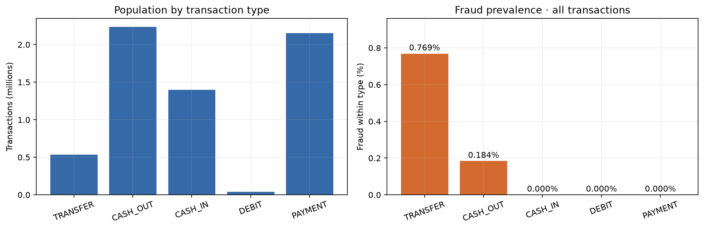
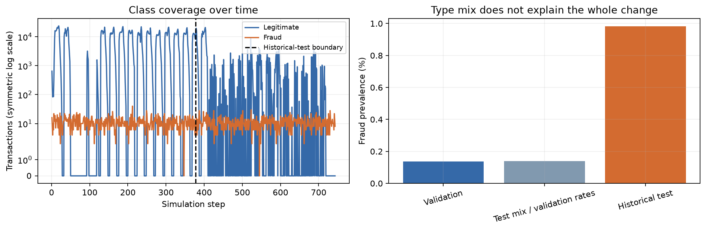

# Detailed results and interpretation

This report preserves the full evidence behind the concise project overview. The balance-free development models are conservative research baselines; the balance-dependent model is an original historical experiment with unverified input provenance. No deployment effectiveness is claimed.

## Business question and decision point

At transaction initiation, should a **TRANSFER or CASH_OUT** be referred for investigation or additional authentication? The scope is these two transaction types, where all fraud labels occur in this file. An alert is a referral, not proof of fraud or an automatic decline. Results do not establish effectiveness in a UK bank.

Requested amount and type are initiation-time inputs. The original model also used recorded opening origin balance and deterministic amount/balance relationships. Closing balances, balance residuals, account identifiers, `isFlaggedFraud`, time and the fraud label never enter its feature matrix.

**The key caveat:** the [publisher's dataset card](https://www.kaggle.com/datasets/ealaxi/paysim1/data) warns that cancellation behaviour affects balance fields, including opening balances. Their names alone do not establish reliable as-of availability. The original balance-dependent policy is retained as a historical experiment; a separate amount-and-type-only development comparison removes that dependency. Code-level leakage controls cannot resolve a data-generation problem.

## Data and scope

The data comes from the **PaySim synthetic mobile-money dataset** published by Edgar Lopez-Rojas. The [simulator repository](https://github.com/EdgarLopezPhD/PaySim) links to the dataset. See [data/README.md](../data/README.md) for acquisition, citation, placement and the inspected file's SHA-256. The original local download history is not independently verified.

- **6,362,620 total transactions**, with **8,213 fraud labels**: 0.1291% of all transactions.
- **2,770,409 TRANSFER/CASH_OUT transactions**, with fraud prevalence **0.2965% within this eligible population**.
- Observed steps **1–743**. A step is a simulation hour, not a dated UK banking period.
- No missing cells or repeated full-row hashes were found. This does not prove that balance values or labels are semantically correct.
- Amounts are expressed in **dataset currency units**. No GBP conversion or financial saving is assumed.

## How the evidence is separated

| Evidence | Period and use | Interpretation |
|---|---|---|
| Original training | Steps 1–323; 1,951,895 eligible transactions | Preprocessing and models fitted here only. |
| Original validation | Steps 324–377; 410,437 transactions | Original model selected by AP, then threshold by F1. |
| Previously inspected historical test | Steps 378–743; 408,077 transactions | Reproduce the frozen result and replay monitoring; never revise the model against it. |
| Additional ablations and rolling checks | Entirely within steps ≤377 | Development diagnostics; no new independent test claim. |

Whole steps stay together. The original approximate 70/15/15 volume split is preserved with fixed boundaries. Logistic Regression is the interpretable baseline; ordinary and class-weighted histogram gradient boosting provide a limited non-linear comparison. All three original candidates achieved validation AP of 1.0000, so the predeclared candidate-order tie-break selected Logistic Regression. The F1 threshold was selected on validation only and is frozen at **0.911738629900**. There is no train-plus-validation refit and no accuracy-based selection.

## What the credibility checks show

The ablations use the same original training/validation windows. Each variant's threshold is selected on validation, so the F1 values are development estimates, not independent policy performance.

| Feature set | Logistic AP | Logistic F1 | Histogram boosting AP | Histogram boosting F1 |
|---|---:|---:|---:|---:|
| Original full features | 1.0000 | 1.0000 | 1.0000 | 1.0000 |
| Without full-balance flag | 0.6728 | 0.6397 | 0.8605 | 0.7867 |
| Without explicit relationships | 0.0186 | 0.0478 | 0.6196 | 0.6059 |
| Amount and type only | 0.0033 | 0.0123 | 0.1655 | 0.2632 |

Removing only the full-balance indicator materially reduces performance; removing all balance information reduces it further. Non-linear models can recover some relationships even when explicit ratio features are removed. These results demonstrate reliance on recorded balance patterns, but do not identify the exact simulator mechanism or prove causality.

Three expanding-window checks use separate fitting, threshold-selection and subsequent forward-evaluation periods, all before step 378. Each forward window contains 227,817–303,112 transactions and 390–436 fraud labels. Later fitting windows may include earlier evaluation data, so these are correlated development checks.

| Fixed model specification | Forward AP range | Forward recall range | Forward alert-rate range |
|---|---:|---:|---:|
| Original logistic features | 0.9928–1.0000 | 99.28–99.77% | 0.128–0.181% |
| Amount/type logistic | 0.0032–0.0457 | 6.41–69.72% | 0.128–19.950% |
| Amount/type histogram boosting | 0.1521–0.1778 | 16.06–17.79% | 0.027–0.080% |

The amount/type logistic model's alert rate reaches **19.9495%** in one forward window despite a validation-selected F1 threshold. That is a useful operational warning: optimising a single-window metric does not secure stable review workload. Full window definitions, sample sizes, prevalence, precision, recall, F1, AP and alert counts are saved in [rolling windows](../reports/tables/development_rolling_windows.csv) and [rolling results](../reports/tables/development_rolling_results.csv). No additional experiment replaces or receives the original policy's historical-test result.

## Original frozen result — reproduced, not a fresh test

| Population | Fraud prevalence | Precision | Recall | F1 | AP | Alerts | False alerts | Missed fraud |
|---|---:|---:|---:|---:|---:|---:|---:|---:|
| Original validation | 0.1364% | 100.00% | 100.00% | 1.00000 | 1.00000 | 560 | 0 | 0 |
| Previously inspected historical test | 0.9827% | 100.00% | 99.55% | 0.99775 | 1.00000 | 3,992 | 0 | 18 |

AP is non-interpolated average precision, the PR-AUC summary used here. A perfect ranking can coexist with missed fraud at a fixed threshold when later scores shift. These balance-dependent synthetic results are **not evidence of real-bank readiness**.

### Why the fraud rate changes

Observed fraud counts per elapsed step are similar: **10.37** in validation and **10.96** in the historical test. Legitimate transactions per elapsed step fall from **7,590.31** to **1,104.01**. The much smaller legitimate denominator is an important observed contributor to the prevalence difference.

The final **296 records**, at steps 719–743, are all labelled fraud. However, prevalence before that tail is still **0.9108%**, so the tail alone does not explain the gap. Applying validation within-type fraud rates to historical-test type shares gives **0.1385%**, also far below the observed **0.9827%**. The modest type-mix change is not the whole explanation.

Simulation schedules, fraud injection and extraction coverage are **possible explanations**, not verified causes; this CSV provides no run configuration or extraction log to adjudicate them. [Coverage counts](../reports/tables/temporal_class_coverage.csv) and [type-mix calculations](../reports/tables/temporal_type_mix.csv) make the observations auditable.

## Historical monitoring and operational interpretation

Notebook 03 consumes **saved frozen-policy predictions**; it does not refit or rescore a new model. It covers per-step volumes and alerts, 24-step performance summaries, amount/type/opening-balance/score distributions, type-level performance and missed-fraud diagnostics.

- **At scoring time:** volume, requested amount, type mix, scores and alert volumes/rates. Balance-dependent indicators retain the feature-provenance caveat.
- **After confirmation:** fraud prevalence, precision, recall, false positives and missed fraud. The replay uses retrospective labels; confirmation timing and real-time label coverage cannot be reconstructed.
- **Monitoring rules:** development-reference 1st/99th-percentile bands; development-defined PSI bins; explicitly illustrative PSI >0.20 and type-share movement >10 percentage points. None is optimised against replay outcomes.

The 54-step reference already includes some very high per-step alert rates, making its percentile band broad. A small number of watch flags is not evidence that the remaining periods are stable. Longer, seasonally matched development references would be needed for operational limits.

The original replay produces **97.82 reviews per 10,000 eligible transactions**, with **0 observed false alerts** and **18 missed fraud transactions**. False alerts in a real workflow can delay legitimate payments, consume analyst time and create customer contacts; zero observed false alerts here is not a guarantee of zero friction. Counts are transactions, not unique customers or deduplicated cases.

Of the misses, **13 are zero-amount CASH_OUT records** and **five are TRANSFER records**. That prompts a check of label and amount semantics, not test-driven threshold adjustment. Summed transaction values are not net losses or money saved: linked transfer/cash-out legs can count the same funds twice. A viable policy would require investigation capacity, handling times and intervention costs, none of which are supplied here.

